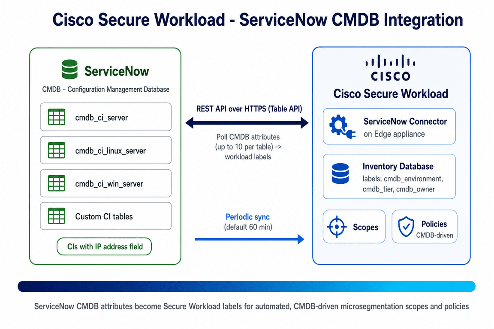

# Cisco Secure Workload → ServiceNow CMDB Integration Guide

A step-by-step integration guide for enriching Cisco Secure Workload (CSW) inventory with **ServiceNow CMDB** attributes via the **ServiceNow connector**. Imported CI attributes (owner, environment, tier, compliance class, …) become CSW **labels** that drive **CMDB-driven microsegmentation** scopes and policies — no manual label maintenance.

[-62D84E?logo=servicenow&logoColor=white)](https://www.servicenow.com/products/servicenow-platform/configuration-management-database.html)

> **⚠ Disclaimer:** This is a **community reference guide** prepared by Cisco Solutions Engineering — not an official Cisco product document. Always refer to the [official Cisco Secure Workload documentation](https://www.cisco.com/c/en/us/support/security/tetration/series.html) and the [Compatibility Matrix](https://www.cisco.com/c/m/en_us/products/security/secure-workload-compatibility-matrix.html) for authoritative, up-to-date guidance.

---

## What This Covers

| Area | Detail |
|---|---|
| **Integration type** | ServiceNow connector — inventory **enrichment / labels** (runs on the CSW **Edge appliance**) |
| **Data imported** | CMDB CI attributes from any table with an **IP address field** (`cmdb_ci_server`, Linux/Windows/app server, custom, or Scripted REST APIs) |
| **Transport** | HTTPS to the ServiceNow **Table API** (REST) |
| **Attributes** | **Up to 10 attributes per table**; multiple tables per instance |
| **Sync** | Full initial sync, then periodic (**default 60 min**); stale labels are removed on sync |
| **Enforcement** | **None** — this is **label enrichment only**; nothing is written back to ServiceNow |
| **Result** | Matching IPs annotated with `cmdb/*`-style labels for scopes & policies |
| **Verified against** | CSW 4.x on-prem and SaaS |

---

## Quick Start

### Prerequisites
- ServiceNow instance reachable over **HTTPS** from the CSW **Edge appliance**
- A dedicated ServiceNow service account with **`cmdb_read`** (and **`web_service_admin`** if using Scripted REST APIs)
- Target tables must expose an **IP address field** (`ip_address` or equivalent)
- (Scripted REST APIs) must support `sysparm_limit`, `sysparm_fields`, `sysparm_offset`; no path parameters
- CSW **Edge appliance** deployed and registered; labels/annotations enabled on the target VRF/tenant
- Firewall: HTTPS (TCP/443) from Edge appliance → ServiceNow instance

### Steps (summary)

**On ServiceNow:**
1. Create a service account (e.g. `csw_connector_svc`) with `cmdb_read` (+ `web_service_admin` if needed)
2. Identify the CMDB tables to import and confirm each has an IP address field
3. (Optional) build a Scripted REST API for custom data

**On Cisco Secure Workload:**
1. `Manage → Virtual Appliances` → select the **Edge appliance**
2. **Connectors** → **+ Add Connector** → **ServiceNow**; enter Instance URL, Username, Password
3. **Discover Tables** → select tables, pick the **IP address field** as key, choose **up to 10 attributes**
4. Set the **sync interval** (default 60 min) → **Test and Apply**

**Verify:**
1. Connector shows **Status: Active**
2. `Inventory → Workloads` — search a known CI by IP and confirm `cmdb/*` labels
3. In **Explore**, run `label cmdb/environment exists`

See the [full step-by-step guide](CSW-ServiceNow-Integration-Guide.md) or [open the HTML version](CSW-ServiceNow-Integration-Guide.html) for detailed instructions.

---

## Video References

> **Legend:** 🎬 video · 📘 guide · 📄 doc

| Reference | What it shows |
|---|---|
| [🎬 CSW User Education video library](https://github.com/chandrapati/CSW-User-Education) | Curated Secure Workload concept explainers and walkthroughs |
| [📘 ServiceNow CMDB Integration Guide](CSW-ServiceNow-Integration-Guide.md) | This repo's full step-by-step deployment guide |
| [📄 Cisco docs — External Orchestrators & Connectors](https://www.cisco.com/c/en/us/td/docs/security/workload_security/secure_workload/user-guide/4_0/cisco-secure-workload-user-guide-on-prem-v40/configure-and-manage-connectors-for-secure-workload.html) | Authoritative connector behavior, attributes, and limits |

---

## Architecture Diagram

*The ServiceNow connector on the CSW Edge appliance polls the Table API over HTTPS, pulls CMDB attributes from CIs that carry an IP address, and publishes them as `cmdb/*` labels into the CSW inventory database — driving CMDB-based scopes and policies.*

---

## Files in This Repo

| File | Description |
|---|---|
| [`README.md`](README.md) | This file — quick start and overview |
| [`CSW-ServiceNow-Integration-Guide.md`](CSW-ServiceNow-Integration-Guide.md) | Full step-by-step guide (Markdown source) |
| [`CSW-ServiceNow-Integration-Guide.html`](CSW-ServiceNow-Integration-Guide.html) | Styled HTML — open in browser for best experience |
| [`csw-servicenow-architecture.png`](csw-servicenow-architecture.png) | Architecture diagram |
| [`build.sh`](build.sh) | Regenerate HTML from Markdown (requires pandoc) |

---

## Imported Labels — Quick Reference

Example CMDB attribute → CSW label mappings (yours will match your table schema):

| ServiceNow Field | CSW Label Example |
|---|---|
| `name` | `cmdb/name` |
| `environment` | `cmdb/environment` |
| `u_business_unit` | `cmdb/business_unit` |
| `u_application_owner` | `cmdb/owner` |
| `u_tier` | `cmdb/tier` |
| `u_compliance_class` | `cmdb/compliance_class` |

> **Important:** Only CIs **with an IP address field** are matched. **Up to 10 attributes per table**; add multiple tables as needed. Sync is a **full pull** on start then periodic (default 60 min); IPs no longer present in ServiceNow **lose** their CMDB labels on the next sync. This integration **does not** enforce or write back to ServiceNow.

---

## Step-by-Step Guides

> **Legend:** 🎬 video · 📘 guide · 📄 doc

Hands-on integration and deployment guides — follow these top to bottom to build out a deployment:

| Guide | Description | Best for |
|-------|-------------|---------|
| [📘 Agent Installation](https://github.com/chandrapati/CSW-Agent-Installation-Guide) | Deploy CSW agents on Linux / Windows / cloud | Day-1 sensor deployment |
| [📘 Policy Lifecycle](https://github.com/chandrapati/CSW-Policy-Lifecycle) | Policy discovery → enforcement workflow | Policy management |
| [📘 ISE / pxGrid](https://github.com/chandrapati/csw-ise-integration) | ISE/pxGrid: user-identity–aware microsegmentation | Identity & Zero Trust |
| [📘 AnyConnect NVM](https://github.com/chandrapati/csw-anyconnect-nvm) | Endpoint process flows + user identity via NVM | Endpoint telemetry |
| [📘 ServiceNow CMDB](https://github.com/chandrapati/csw-servicenow-integration) | ServiceNow CMDB label enrichment for workload scopes | CMDB-driven policy |
| [📘 Infoblox](https://github.com/chandrapati/csw-infoblox-integration) | Infoblox IPAM/DNS extensible-attribute label enrichment | IPAM/DNS-driven policy |
| [📘 F5 BIG-IP](https://github.com/chandrapati/csw-f5-integration) | F5 virtual-server labels, policy enforcement, IPFIX flow visibility | Load balancer segmentation |
| [📘 NetScaler ADC](https://github.com/chandrapati/csw-netscaler-integration) | NetScaler LB virtual-server labels, ACL enforcement + AppFlow/IPFIX flow visibility | Load balancer segmentation |
| [📘 AWS Connector](https://github.com/chandrapati/csw-aws-connector) | EC2 tag ingestion + VPC flow logs + Security Group enforcement | AWS workloads |
| [📘 Azure Connector](https://github.com/chandrapati/csw-azure-connector) | Azure VM tag ingestion + VNet flow logs + NSG enforcement | Azure workloads |
| [📘 GCP Connector](https://github.com/chandrapati/csw-gcp-connector) | GCE label ingestion + VPC flow logs + firewall enforcement | GCP workloads |
| [📘 NetFlow](https://github.com/chandrapati/csw-netflow-integration) | NetFlow v9/IPFIX agentless flow ingestion from switches | Network fabric visibility |
| [📘 ERSPAN](https://github.com/chandrapati/csw-erspan-integration) | Agentless packet mirroring for legacy / OT / IoT devices | Deep agentless visibility |
| [📘 Secure Firewall](https://github.com/chandrapati/CSW-Secure-Firewall-Integration-Guide) | NSEL flow ingestion from Cisco Secure Firewall (FTD/ASA) | Firewall flow visibility |
| [📘 Splunk Integration](https://github.com/chandrapati/csw-splunk-integration) | CSW syslog alerts → Splunk SIEM | SecOps / SIEM teams |

## Resources

> **Legend:** 🎬 video · 📘 guide · 📄 doc

Learning paths, reference material, and day-2 tooling:

| Resource | Description | Best for |
|----------|-------------|---------|
| [📘 User Education](https://github.com/chandrapati/CSW-User-Education) | Onboarding guides, concept explainers, and curated video library | New CSW users |
| [📘 Compliance Mapping](https://github.com/chandrapati/CSW-Compliance-Mapping) | Map CSW controls to NIST, PCI-DSS, HIPAA, CIS | Compliance & audit |
| [📘 Tenant Insights](https://github.com/chandrapati/CSW-Tenant-Insights) | Tenant-level reporting and analytics | Visibility metrics |
| [📘 Operations Toolkit](https://github.com/chandrapati/CSW-Operations-Toolkit) | Day-2 ops scripts: health checks, reporting, policy analysis | Ongoing operations |
| [📄 Supported OS & Compatibility Matrix](https://www.cisco.com/c/m/en_us/products/security/secure-workload-compatibility-matrix.html) | Cisco's authoritative list of supported agent operating systems, external systems, and connector requirements | Platform planning & prerequisites |

> **Suggested customer journey:**
> User Education → Agent Installation → Policy Lifecycle → ISE/pxGrid → ServiceNow CMDB → Infoblox → F5 BIG-IP → NetScaler ADC → Splunk Integration → Compliance Mapping → Operations Toolkit
